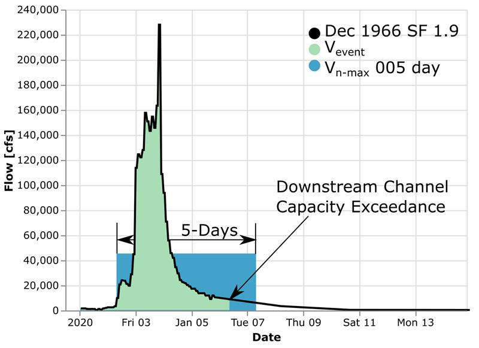
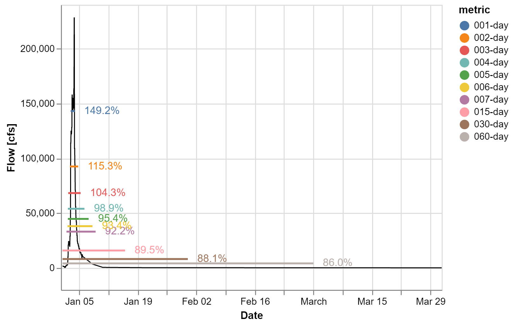

# Introduction

This repository is a work in progress.  The goal of this repository is to perform critical duration analyses using the CVHS volume window method.  

```math
V_w = \frac{V_{Event}}{V_{n-day}}
```

The following figure summarized the volume used in the method



And produces plots like


