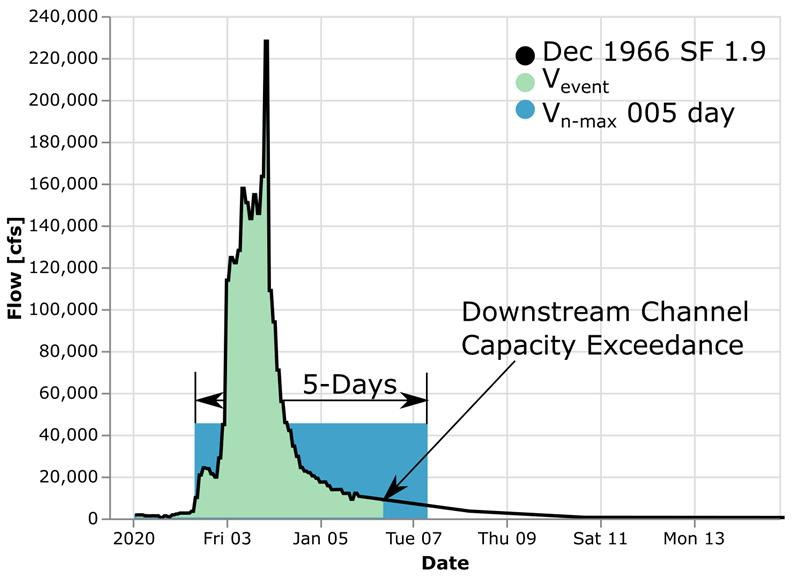

# Critical Duration Analysis

This project is designed to analyze critical inflow volume duration events using hydrological data. It processes data from DSS files, calculates relevant metrics, and visualizes the results through interactive plots.

The library calculated the volume window, a ratio of the event volume to n-day unregulated volume durations.

```math
V_{window} = \frac{V_{Event}}{V_{n-day}}
```



[readthedocs](https://criticalduration.readthedocs.io/en/latest/)

## Project Structure

```
CriticalDuration
├── critical_duration
│   ├── __init__.py
│   ├── data_processing.py
│   ├── plotting.py
│   ├── utils.py
│   └── main.py
├── scripts
│   └── run_analysis.py
├── data
│   └── Terminus_Data.dss
├── tests
│   ├── __init__.py
│   └── test_critical_duration.py
├── pyproject.toml
├── uv.lock
├── .python-version
└── README.md
```

## Installation

This project uses [uv](https://docs.astral.sh/uv/) for fast Python package and project management.

### Prerequisites

Install uv if you haven't already:

```bash
# Windows
powershell -c "irm https://astral.sh/uv/install.ps1 | iex"

# macOS/Linux
curl -LsSf https://astral.sh/uv/install.sh | sh
```

### Install Dependencies

Install the project and its dependencies:

```bash
uv sync
```

For development (includes testing dependencies):

```bash
uv sync --group dev
```

## Usage

To run the analysis, execute the following command:

```bash
uv run python scripts/run_analysis.py
```

Or use the console script:

```bash
uv run run_analysis
```

Make sure to adjust the parameters in `run_analysis.py` as needed for your specific analysis.

## Functions

- **Data Processing**: The `data_processing.py` module contains functions for reading and processing hydrological data from DSS files.
- **Plotting**: The `plotting.py` module provides functions for visualizing the processed data using Altair.


## Testing

Unit tests for the package can be found in the `tests` directory. To run the tests, use:

```bash
uv run pytest tests/
```

The test data used to validate the computations came from HDR IPAST software.

## License

This project is licensed under the MIT License. See the LICENSE file for details.
